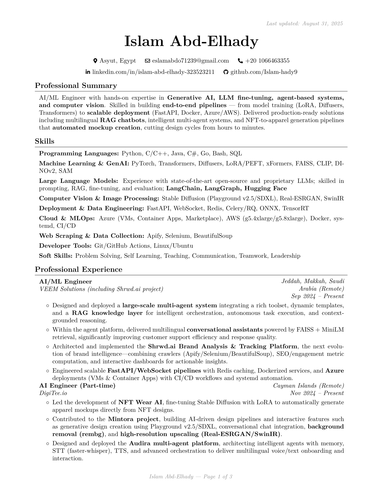

# 📄 Islam AbdElhady — CV

[](https://islam-hady9.github.io/Islam-Abdelhady-CV/Islam_Abdelhady_CV.pdf)  
[](https://islam-hady9.github.io/Islam-Abdelhady-CV/)

---

## 🚀 About
This repository contains the **LaTeX source code** of my personal **Curriculum Vitae (CV)**.  
It is built automatically with **GitHub Actions** and deployed to **GitHub Pages**, ensuring the latest version is always available online.

- ✨ Written in **LaTeX** using the [sb2nov RenderCV theme](https://github.com/sinaatalay/rendercv).  
- ⚙️ **CI/CD pipeline** powered by `latexmk` + GitHub Actions.  
- 🌐 Always up-to-date, hosted with **GitHub Pages**.  
- 🖥️ Optimized for **ATS** with `glyphtounicode` mappings.  

---

## 📥 Download / View

- **Direct PDF:** [Islam_Abdelhady_CV.pdf](https://islam-hady9.github.io/Islam-Abdelhady-CV/Islam_Abdelhady_CV.pdf)  
- **Landing Page:** [GitHub Pages Site](https://islam-hady9.github.io/Islam-Abdelhady-CV/)  

---

## 👀 Preview



*(Preview of the first page — open the PDF for full details.)*

---

## 🛠 Repository Structure

```
├─ cv/                # Main LaTeX sources
│  ├─ Islam_Abdelhady_CV.tex   # Final CV
│  ├─ sb2nov_base.tex          # Base template (reference)
│  ├─ glyphtounicode.tex       # Unicode mapping (ATS-friendly PDFs)
│  ├─ assets/                  # Images, previews
│  └─ build/                   # Temporary build artifacts (ignored)
│
├─ dist/              # ✅ Published to GitHub Pages (contains final PDF + index.html)
│  ├─ Islam_Abdelhady_CV.pdf
│  └─ index.html
│
├─ template/          # Minimal LaTeX template for reuse
├─ tools/             # Build tools
│  ├─ Makefile
│  └─ latexmkrc
│
├─ .github/workflows/ # GitHub Actions CI/CD
│  └─ pages.yml
│
├─ LICENSE
└─ README.md
```

---

## 🔄 How It Works

1. **Edit** your CV in `cv/Islam_Abdelhady_CV.tex`.  
2. **Commit & Push** → GitHub Actions compiles the PDF.  
3. The workflow copies the PDF into `dist/` and **deploys** it to GitHub Pages.  
4. ✅ The CV is instantly live at:  
   - Root: [islam-hady9.github.io/Islam-Abdelhady-CV/](https://islam-hady9.github.io/Islam-Abdelhady-CV/)  
   - PDF: [Islam_Abdelhady_CV.pdf](https://islam-hady9.github.io/Islam-Abdelhady-CV/Islam_Abdelhady_CV.pdf)

---

## 📚 Reusing This Template

If you’d like to use this workflow for your own CV:

1. Fork this repo.  
2. Replace the contents of `cv/Islam_Abdelhady_CV.tex` with your own CV.  
3. Update `README.md` with your details.  
4. Push to `main`.  
5. Enable GitHub Pages → Source: GitHub Actions.  
6. Enjoy an always-up-to-date online CV 🎉.

---

## 📬 Contact

- 🌐 [LinkedIn](https://linkedin.com/in/islam-abd-elhady-323523211)  
- 🐙 [GitHub](https://github.com/islam-hady9)  
- 📧 [Email](mailto:eslamabdo71239@gmail.com)  

---

💡 *This project shows how LaTeX + GitHub Actions + Pages can give you a professional, auto-updating, and easily shareable CV.*